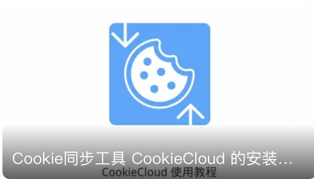
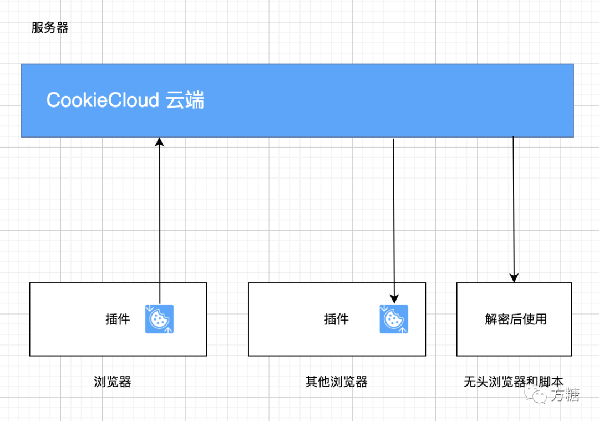
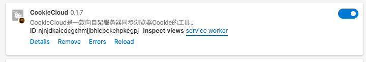

# CookieCloud


CookieCloud是一个和自架服务器同步Cookie的小工具，可以将浏览器的登录态同步到手机和云端，它内置端对端加密，可设定同步时间间隔。

> 最新版本支持了对同域名下local storage的同步

[Telegram频道](https://t.me/CookieCloudTG) | [Telegram交流群](https://t.me/CookieCloudGroup)

## ⚠️ Breaking Change

由于支持 local storage 的呼声很高，因此插件版本 0.1.5+ 除了 cookie 也支持了 local storage，这导致加密文本格式变化（从独立cookie对象变成{ cookie_data, local_storage_data }）。

另外，为避免配置同步导致的上下行冲突，配置存储从 remote 改到了 local，使用之前版本的同学需要重新配置一下。

对此带来的不便深表歉意 🙇🏻‍♂️


## 官方教程

  

1. 视频教程：[B站](https://www.bilibili.com/video/BV1fR4y1a7zb) | [Youtube](https://youtu.be/3oeSiGHXeQw) 求关注求订阅🥺
1. 图文教程：[掘金](https://juejin.cn/post/7190963442017108027)

## FAQ

1. 目前只支持单向同步，即一个浏览器上传，一个浏览器下载
2. 浏览器扩展只官方支持 Chrome 和 Edge。其他 Chrome 内核浏览器可用，但未经测试。使用源码 `cd extension && pnpm build --target=firefox-mv2` 可自行编译 Firefox 版本，注意 Firefox 的 Cookie 格式和 Chrome 系有差异，不能混用

  

## 浏览器插件

1. 商店安装：[Edge商店](https://microsoftedge.microsoft.com/addons/detail/cookiecloud/bffenpfpjikaeocaihdonmgnjjdpjkeo) | [Chrome商店](https://chrome.google.com/webstore/detail/cookiecloud/ffjiejobkoibkjlhjnlgmcnnigeelbdl)（ 注意：商店版本会因审核有延迟
1. 手动下载安装：见 Release

## 服务器端

### 第三方

> 由第三方提供的免费服务器端，可供试用，稳定性由第三方决定。感谢他们的分享 👏

> 由于部分服务器端版本较久，如测试提示失败可添加域名关键词再试

- <http://45.138.70.177:8088> 由[LSRNB](https://github.com/lsrnb)提供
- <http://45.145.231.148:8088> 由[shellingford37](https://github.com/shellingford37)提供
- <http://nastool.cn:8088> 由[nastools](https://github.com/jxxghp/nas-tools)提供
- <https://cookies.xm.mk> 由[Xm798](https://github.com/Xm798)提供

### 自行架设

#### 方案一：通过Docker部署，简单、推荐方案

支持架构：linux/amd64,linux/arm/v7,linux/arm64/v8,linux/ppc64le,linux/s390x

```bash
docker run -p=8088:8088 easychen/cookiecloud:latest
```
默认端口 8088 ，镜像地址 [easychen/cookiecloud](https://hub.docker.com/r/easychen/cookiecloud)

##### 指定API目录·可选步骤可跳过

添加环境变量 -e API_ROOT=/`二级目录需要以斜杠开头` 可以指定二级目录:

```bash
docker run -e API_ROOT=/cookie -p=8088:8088 easychen/cookiecloud:latest
```

#### 方案二：通过 Node 部署

> 适用于没有 docker 但支持 node 的环境，需要自行先安装 node

```bash
cd api && yarn install && node app.js
```
默认端口 8088 ，同样也支持 API_ROOT 环境变量

## 调试和日志查看

进入浏览器插件列表，点击 service worker，会弹出一个面板，可查看运行日志

  

## API 接口

上传：

- method: POST
- url: /update
- 参数
  - uuid
  - encrypted: 本地加密后的字符串

下载：

- method: POST/GET
- url: /get/:uuid
- 参数：
   - password:可选，不提供返回加密后的字符串，提供则发送尝试解密后的内容；


## Cookie加解密算法

### 加密

const data = JSON.stringify(cookies);

1. md5(uuid+password) 取前16位作为key
2. AES.encrypt(data, the_key)

### 解密

1. md5(uuid+password) 取前16位作为key
2. AES.decrypt(encrypted, the_key)

解密后得到 data ，JSON.parse(data) 得到数据对象{ cookie_data, local_storage_data };

参考函数

```node
function cookie_decrypt( uuid, encrypted, password )
{
    const CryptoJS = require('crypto-js');
    const the_key = CryptoJS.MD5(uuid+'-'+password).toString().substring(0,16);
    const decrypted = CryptoJS.AES.decrypt(encrypted, the_key).toString(CryptoJS.enc.Utf8);
    const parsed = JSON.parse(decrypted);
    return parsed;
}
```

`extension/function.js` 查看更多

## 无头浏览器使用CookieCloud示例

请参考 `examples/playwright/tests/example.spec.js` 

```javascript
test('使用CookieCloud访问nexusphp', async ({ page, browser }) => {
  // 读取云端cookie并解密
  const cookies = await cloud_cookie(COOKIE_CLOUD_HOST, COOKIE_CLOUD_UUID, COOKIE_CLOUD_PASSWORD);
  // 添加cookie到浏览器上下文
  const context = await browser.newContext();
  await context.addCookies(cookies);
  page = await context.newPage();
  // 这之后已经带着Cookie了，按正常流程访问
  await page.goto('https://demo.nexusphp.org/index.php');
  await expect(page.getByRole('link', { name: 'magik' })).toHaveText("magik");
  await context.close();
});

```

### 函数

```javascript
async function cloud_cookie( host, uuid, password )
{
  const fetch = require('cross-fetch');
  const url = host+'/get/'+uuid;
  const ret = await fetch(url);
  const json = await ret.json();
  let cookies = [];
  if( json && json.encrypted )
  {
    const {cookie_data, local_storage_data} = cookie_decrypt(uuid, json.encrypted, password);
    for( const key in cookie_data )
    {
      // merge cookie_data[key] to cookies
      cookies = cookies.concat(cookie_data[key].map( item => {
        if( item.sameSite == 'unspecified' ) item.sameSite = 'Lax';
        return item;
      } ));
    }
  }
  return cookies;
}

function cookie_decrypt( uuid, encrypted, password )
{
    const CryptoJS = require('crypto-js');
    const the_key = CryptoJS.MD5(uuid+'-'+password).toString().substring(0,16);
    const decrypted = CryptoJS.AES.decrypt(encrypted, the_key).toString(CryptoJS.enc.Utf8);
    const parsed = JSON.parse(decrypted);
    return parsed;
}
```
